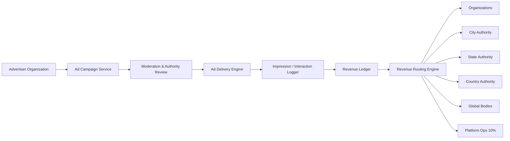
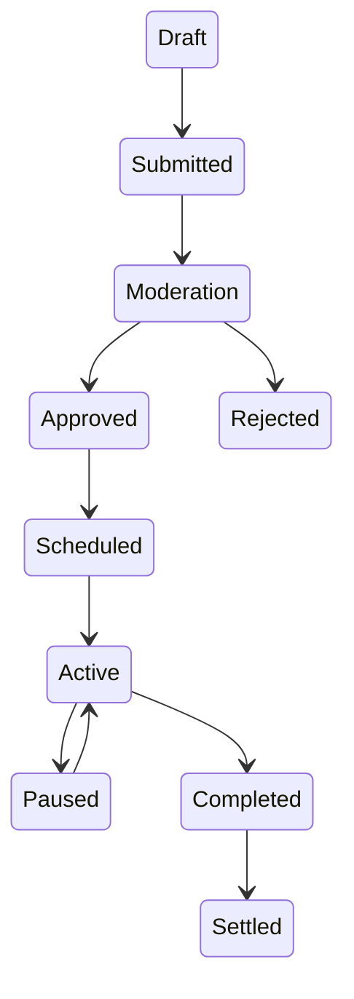
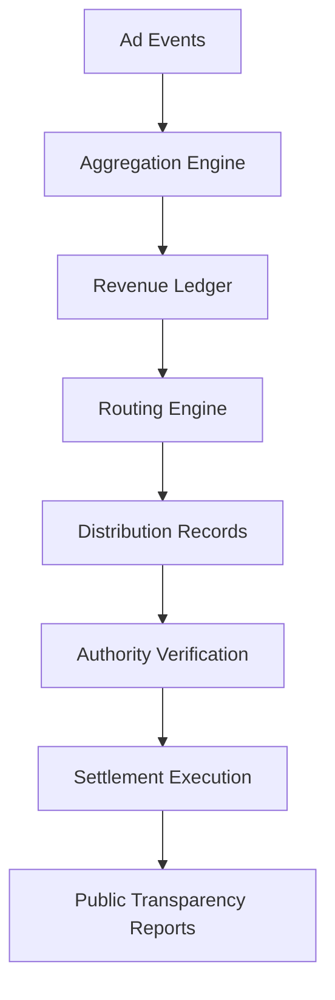

# Musallih Platform – Ads & Revenue Ledger Technical Design

This document defines the **technical architecture, data models, workflows, and enforcement rules** for the Musallih platform’s **ethical advertising and revenue routing system**.

The system is designed to:
- enable organizations to promote services ethically
- prevent commercial abuse
- ensure geographic fairness
- route proceeds transparently
- fund platform operations sustainably

This is **not a conventional ad network**. It is a **geo‑jurisdictional community funding engine**.

---

# 1. Core Design Principles

1. No opaque bidding systems
2. No user profiling
3. Location‑scoped relevance only
4. Authority‑visible accounting
5. Ledger‑based, not balance‑based
6. Immutable financial records
7. Jurisdiction‑aware routing
8. Community benefit first

---

# 2. High‑Level Architecture

---

# 3. Domain Components

## 3.1 Ad Campaign Service

Responsibilities:
- campaign creation
- geo‑scope definition
- creative management
- scheduling
- budget enforcement

Key rules:
- campaigns always belong to a verified organization
- every campaign has one geo‑scope
- creative must pass moderation

---

## 3.2 Moderation & Authority Review

All campaigns go through:
- automated checks
- organization admin approval
- authority approval (based on scope)

Scope → Required reviewer
- Radius → Organization + City
- City → City Authority
- State → State Authority
- Country → Country Authority
- Global → Global Authority

---

## 3.3 Ad Delivery Engine

Responsibilities:
- serve ads contextually
- enforce geo proximity
- frequency caps
- content relevance filters

Inputs:
- user coarse location
- app context (map, services, events)
- active campaigns

Restrictions:
- no behavioral profiling
- no cross‑app tracking
- no sale of user data

---

## 3.4 Interaction Logger

Every billable action is an **event**:

- impression
- click
- call / message tap
- request initiated

Events record:
- campaign_id
- org_id
- timestamp
- geo_cell
- placement
- pricing unit

All events are append‑only.

---

## 3.5 Revenue Ledger (Core)

The ledger is the **financial truth source**.

No balances are directly updated.
All revenue is derived from ledger aggregation.

### Tables

#### AdEvent
- id
- campaign_id
- event_type
- billable_amount
- geo_scope
- jurisdiction_ids
- occurred_at

#### RevenueLedger
- id
- ad_event_id
- gross_amount
- platform_fee
- local_pool
- authority_pool
- settlement_status

#### RevenueDistribution
- id
- ledger_id
- recipient_type
- recipient_id
- amount
- period

---

## 3.6 Revenue Routing Engine

Determines who gets what.

Routing logic depends on campaign scope:

Radius campaign:
- 10% → platform
- 90% → local organizations pool

City campaign:
- 10% → platform
- 90% → city authority / approved charities

State campaign:
- 10% → platform
- 90% → state authority

Country campaign:
- 10% → platform
- 90% → national bodies

Global campaign:
- 10% → platform
- 90% → global funds

Routing creates **RevenueDistribution** entries.

---

# 4. Campaign Lifecycle

---

# 5. Settlement Workflow

Settlement periods:
- daily provisional
- monthly final

No retroactive edits allowed.
Only compensating entries.

---

# 6. Transparency & Audit Model

Mandatory:
- public campaign registry
- authority‑visible ledgers
- downloadable monthly statements
- anomaly detection

Every ledger entry is:
- immutable
- timestamped
- authority‑scoped
- reproducible

---

# 7. Abuse & Safety Controls

- creative approval
- campaign caps
- spending limits
- emergency campaign freeze
- authority kill‑switch
- public reporting

High‑risk triggers:
- burial services
- welfare campaigns
- nikah services

These require manual authority sign‑off.

---

# 8. API Design

### Advertiser
- POST /ads/campaigns
- GET /ads/campaigns/{id}
- GET /ads/analytics

### Authority
- POST /ads/{id}/approve
- GET /ads/ledger
- GET /ads/distributions

### Platform
- POST /ads/settlements/run

---

# 9. Security Requirements

- signed creatives
- organization‑bound tokens
- separation of duties
- financial event hashing
- dual‑control settlement

---

# 10. Engineering Requirements

Services:
- Ad Campaign Service
- Moderation Service
- Delivery Engine
- Event Logger
- Ledger Service
- Routing Engine
- Settlement Processor
- Transparency API

Infrastructure:
- append‑only event store
- relational ledger DB
- analytics warehouse

---

# 11. UX Implications

Organization App:
- campaign builder
- geo‑scope picker
- spend transparency

Authority App:
- approval console
- ledger viewer
- settlement approvals

Musallih App:
- labeled promoted listings
- relevance tags
- reporting tools

---

# 12. Design Guarantees

- ads fund community, not extract it
- no hidden routing
- no centralized profit capture
- no sale of personal data

---

This system ensures Musallih can sustain itself operationally while remaining **ethically aligned, jurisdiction‑respecting, and transparent by default**.

