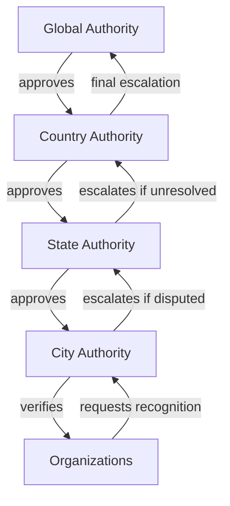
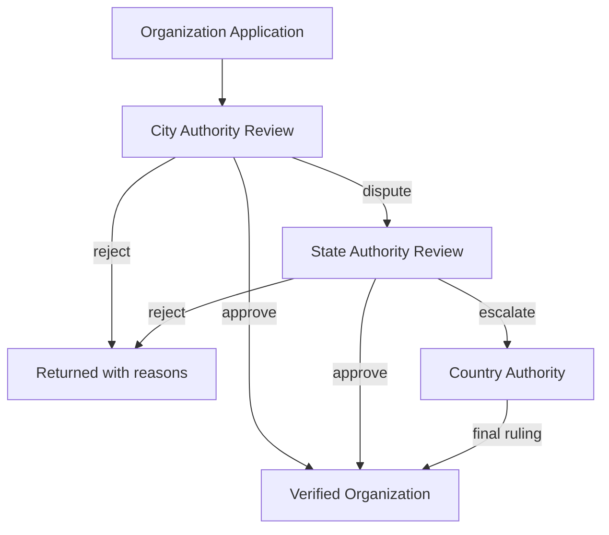
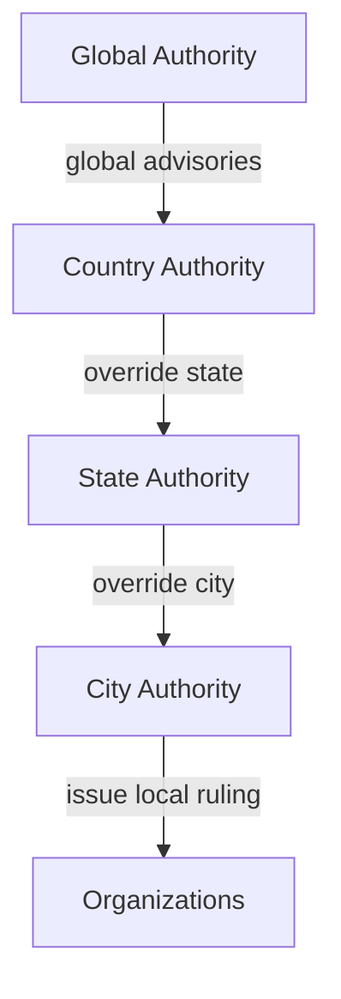
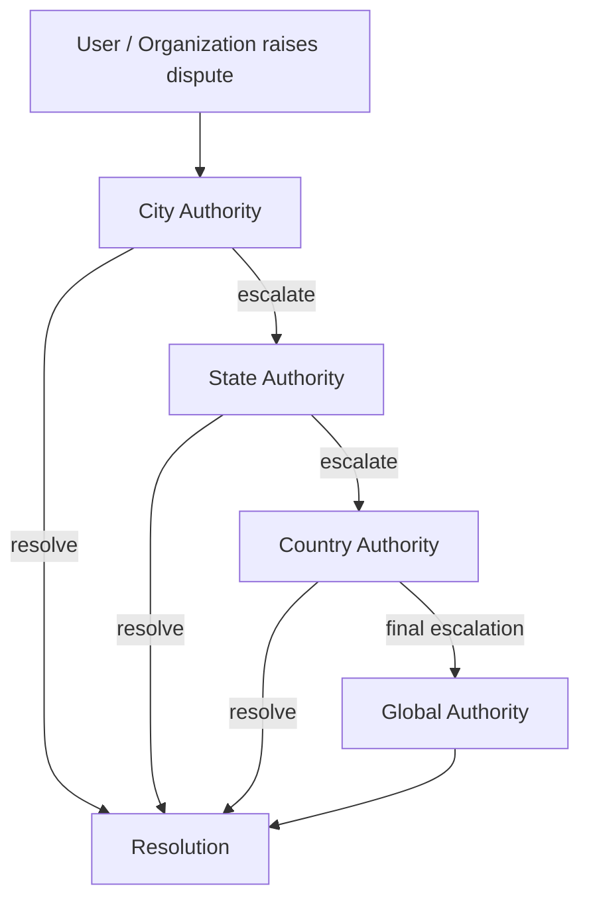
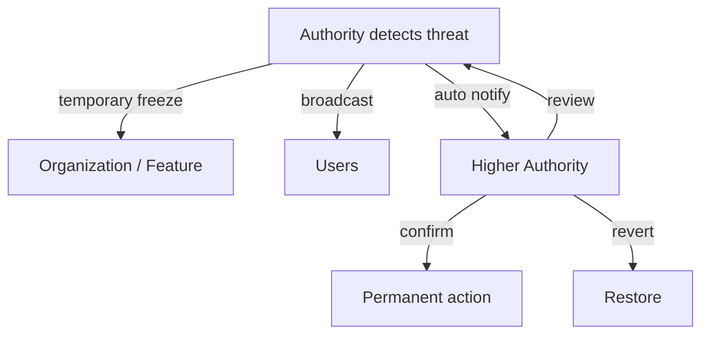
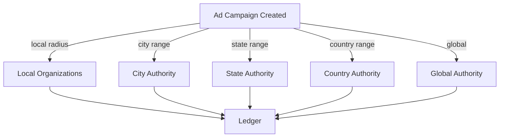

# Musallih Platform – Authority Jurisdiction & Escalation Flow Diagrams

This document defines the **governance topology, jurisdiction rules, and escalation workflows** for the Musallih open Islamic civic infrastructure platform.

It establishes how authority flows across levels, how actions are validated, and how disputes, overrides, and emergencies are handled.

---

# 1. Authority Hierarchy Model

The platform uses a **federated, hierarchical authority system** with clearly bounded jurisdictions.

Levels:

- Global Authority Body
- Country Islamic Authority
- State / Provincial Authority
- City / Regional Authority
- Verified Organizations (Masjids & Institutions)

Each level:
- is mapped to a geo-boundary
- can only act within its jurisdiction
- cannot bypass audit systems
- cannot directly modify private user data

---

# 2. Jurisdiction Ownership Rules

## 2.1 Authority

An Authority:
- owns a geo-boundary (polygon)
- approves organizations located within it
- appoints lower authorities
- publishes rulings valid only inside its boundary

No authority may:
- self-create higher authorities
- operate outside its geo-boundary
- remove audit logs

---

## 2.2 Organization

Every organization must:
- belong to exactly one city authority
- inherit state and country authorities through hierarchy
- comply with all active rulings

Organizations cannot:
- change jurisdiction themselves
- self-verify
- override calendar/prayer without permission

---

# 3. Jurisdiction Validation Flow

Every sensitive action passes:

1. Identity check
2. Role check
3. Organization relationship check
4. Geo-boundary validation
5. Authority scope validation
6. Consent engine
7. Audit logging

---

# 4. Authority Creation & Onboarding Flow

---

# 5. Organization Verification Flow

---

# 6. Rulings & Overrides Flow

Used for:
- Hijri calendar decisions
- Eid declarations
- prayer system exceptions
- emergency notices

Rules:
- Lower authorities may issue only local rulings
- Higher authorities may override, but overrides are logged and publicly visible

---

# 7. Dispute & Escalation Flow

Used for:
- institution conflicts
- data disputes
- calendar disagreements
- ad revenue conflicts

---

# 8. Emergency Powers Flow

Used for:
- misinformation
- system abuse
- extremist content
- security breaches

Emergency actions:
- are temporary
- require post-action review
- are always audit logged

---

# 9. Ads & Revenue Escalation Flow

Disputes:
- handled first by City
- escalated upward
- settlements require authority signature

---

# 10. Technical Enforcement Rules

- Authorities stored with geo-polygons (PostGIS)
- Every organization mapped to exactly one city authority
- All authority actions require:
  - signed identity
  - multi-factor authentication
  - audit logging
  - jurisdiction validation

- Overrides create immutable change records
- Disputes create frozen snapshots

---

# 11. Design Guarantees

- No global centralization
- No silent overrides
- No authority without geography
- No action without audit
- No emergency without review

---

# 12. Engineering Deliverables

From this model, backend must implement:

- Authority service
- Jurisdiction middleware
- Dispute service
- Rulings registry
- Emergency action handler
- Authority dashboards

---

This authority system is designed to ensure the platform remains:

- federated
- locally governed
- globally coordinated
- resistant to capture
- tr