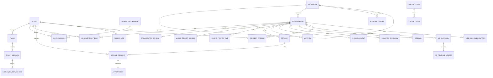

# Musallih Platform – Complete ER Diagram

This document defines the **canonical data model** for the Musallih open-source Islamic civic infrastructure platform.

It is organized into logical domains and followed by a unified ER diagram representation (Mermaid).

---

# 1. Identity & Family Domain

## User
- id (PK)
- full_name
- phone
- email
- dob
- gender
- marital_status
- city_id
- education_level (optional)
- field_of_study (optional)
- occupation (optional)
- income_range (optional)
- created_at

## Family
- id (PK)
- primary_user_id (FK → User)
- family_name
- address
- city_id
- created_at

## FamilyMember
- id (PK)
- family_id (FK → Family)
- user_id (nullable, FK → User)
- name
- relation
- dob
- gender
- education_level
- occupation
- income_range

## SchoolOfThought
- id (PK)
- name
- category (Sunni/Shia/Other)

## UserSchool
- user_id (FK → User)
- school_id (FK → SchoolOfThought)
- is_primary

## FamilyMemberSchool
- family_member_id (FK → FamilyMember)
- school_id (FK → SchoolOfThought)
- is_primary

---

# 2. Organization & Institution Domain

## Organization
- id (PK)
- name
- type (MASJID, MADRASA, EDUCATION, BURIAL, WELFARE, BUSINESS, NGO)
- description
- geo_location (PostGIS)
- authority_id (FK → Authority)
- verification_status
- primary_contact
- created_at

## OrganizationTeam
- id (PK)
- organization_id (FK → Organization)
- user_id (FK → User)
- role
- permissions_scope

## OrganizationSchool
- organization_id (FK → Organization)
- school_id (FK → SchoolOfThought)
- is_primary

---

# 3. Masjid & Religious Systems

## MasjidPrayerConfig
- id (PK)
- organization_id (FK → Organization)
- calculation_method
- fajr_angle
- isha_angle
- asr_method
- high_latitude_rule

## MasjidPrayerTime
- id (PK)
- organization_id (FK → Organization)
- date
- fajr_start
- sunrise
- dhuhr
- asr
- maghrib
- isha
- fajr_end
- isha_end

## IslamicCalendarDay
- id (PK)
- gregorian_date
- hijri_date
- hijri_month
- hijri_year
- is_ramadan
- islamic_events

---

# 4. Authority & Governance

## Authority
- id (PK)
- name
- level (CITY, STATE, COUNTRY, GLOBAL)
- parent_id (self FK)
- geo_boundary

## AuthorityAdmin
- id (PK)
- authority_id (FK → Authority)
- user_id (FK → User)
- role

---

# 5. Consent & Governance

## ConsentProfile
- id (PK)
- user_id (FK → User)
- organization_id (FK → Organization)
- scope_json
- valid_from
- valid_to

## AccessLog
- id (PK)
- actor_user_id (FK → User)
- target_user_id (FK → User)
- organization_id (FK → Organization)
- action
- accessed_fields
- created_at

---

# 6. Services, Activities & Requests

## Service
- id (PK)
- organization_id (FK → Organization)
- name
- category
- description
- appointment_enabled
- request_enabled

## Activity
- id (PK)
- organization_id (FK → Organization)
- type (event/class/drive)
- title
- description
- start_time
- end_time
- recurrence

## ServiceRequest
- id (PK)
- requester_user_id (FK → User)
- family_id (nullable FK → Family)
- organization_id (FK → Organization)
- service_id (FK → Service)
- urgency_level
- description
- status
- created_at

## Appointment
- id (PK)
- service_request_id (FK → ServiceRequest)
- scheduled_at
- assigned_to (FK → OrganizationTeam)
- status

---

# 7. Announcements, Donations, Webinars

## Announcement
- id (PK)
- organization_id (FK → Organization)
- authority_id (nullable FK → Authority)
- title
- body
- target_scope
- created_at

## DonationCampaign
- id (PK)
- organization_id (FK → Organization)
- title
- goal_amount
- current_amount
- start_date
- end_date

## Webinar
- id (PK)
- organization_id (FK → Organization)
- title
- live_url
- start_time
- capacity

---

# 8. Business, Ads & Revenue

## BusinessProfile
- id (PK)
- organization_id (FK → Organization)
- category
- documents

## AdCampaign
- id (PK)
- advertiser_org_id (FK → Organization)
- geo_scope
- budget
- start_date
- end_date

## AdRevenueLedger
- id (PK)
- campaign_id (FK → AdCampaign)
- platform_share
- local_share
- authority_share
- settled_at

---

# 9. Partner Platform & OAuth

## OAuthClient
- id (PK)
- name
- redirect_uris
- scopes

## OAuthToken
- id (PK)
- user_id (FK → User)
- client_id (FK → OAuthClient)
- scopes
- expires_at

## WebhookSubscription
- id (PK)
- organization_id (FK → Organization)
- callback_url
- events

---

# 10. Unified ER Diagram (Mermaid)

---

# 11. Notes

- All sensitive fields must be encrypted.
- All write operations must create audit logs.
- All reads of protected data must reference ConsentProfile.
- Organization is the root abstraction for masjids, madrasas, burial authorities, welfare orgs, and businesses.
- Authority is a hierarchical self-referencing entity.

---

This ERD is designed to support:
- federated governance
- consent-based data access
- multi-institution ecosystems
- service & request workflows
- external platform integrations
- ethical revenue routing

