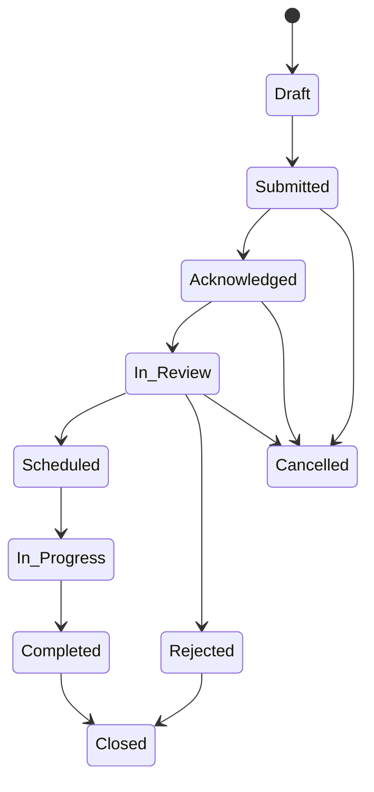
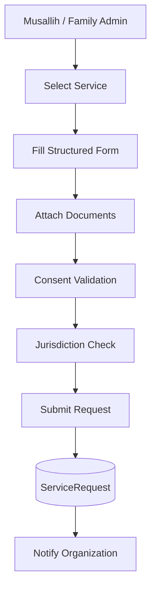
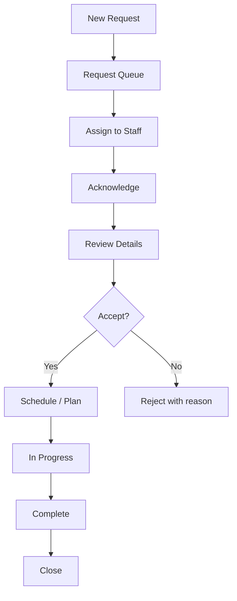
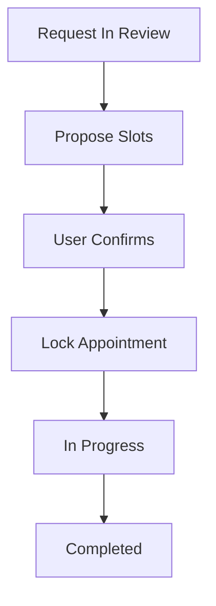
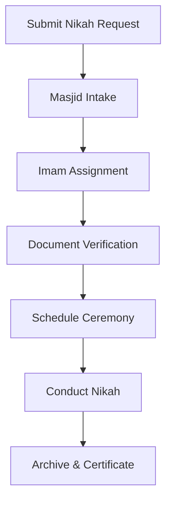
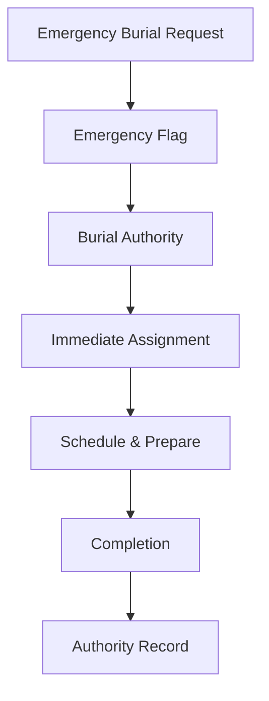
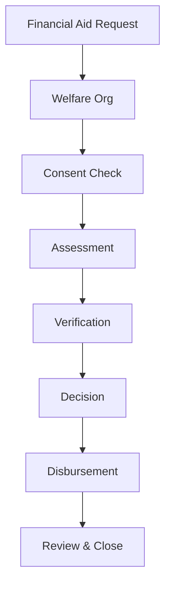
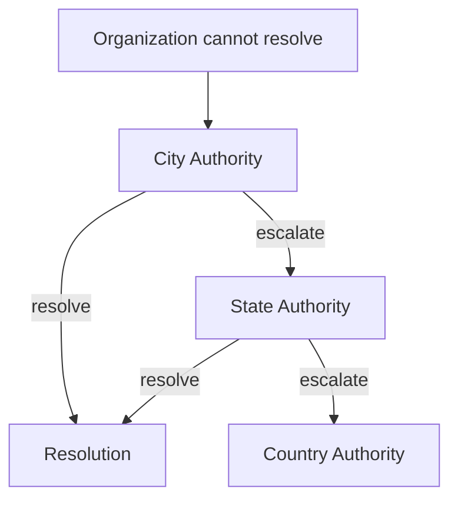
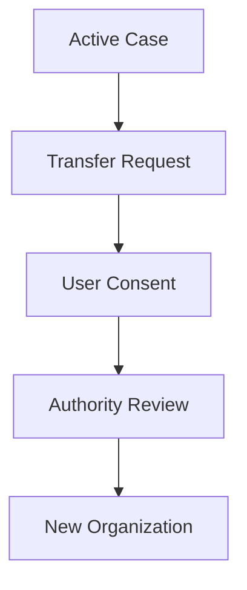

# Musallih Platform – Request & Case-Management Workflow Diagrams

This document defines the **end-to-end workflows, state machines, and escalation paths** for the Musallih platform’s Request & Case-Management system.

This system is the **community operations layer** enabling musallihs and families to request services (nikah, burial, education, welfare, counseling, etc.) and organizations to process them securely and transparently.

---

# 1. Core Design Principles

- Every request is a **case** with lifecycle states
- Every case belongs to exactly one organization
- Every case has:
  - requester
  - service type
  - audit trail
  - consent binding
  - jurisdiction binding

No case can be:
- silently deleted
- reassigned across jurisdictions without authority involvement
- accessed without role + consent validation

---

# 2. Core Entities Involved

- Musallih / Family Admin (requester)
- Organization (case owner)
- Organization Staff (case handlers)
- Authority (oversight / escalation)
- Consent Engine (field-level access)
- Audit System (non‑repudiation)

---

# 3. Universal Request Lifecycle (State Machine)

State definitions:
- Draft: local user form, not yet visible
- Submitted: officially lodged, immutable core fields
- Acknowledged: org has seen it
- In_Review: staff assigned, assessment ongoing
- Scheduled: appointment/date locked
- In_Progress: service being delivered
- Completed: service delivered
- Closed: archived, read‑only
- Cancelled: user/org withdrawal
- Rejected: organization declined (reason mandatory)

---

# 4. Standard Request Submission Flow (Musallih → Organization)

System actions:
- snapshot of consent profile
- geo‑jurisdiction validation
- automatic local contact surfaced
- audit record created

---

# 5. Organization Intake Workflow

Controls:
- SLA timers
- staff assignment limits
- escalation triggers

---

# 6. Appointment Scheduling Flow

Supports:
- rescheduling
- cancellation windows
- authority override (burial emergencies)

---

# 7. High‑Sensitivity Flows

## A. Nikah Requests

Controls:
- imam‑only validation
- authority compliance checks
- mandatory document attachments

---

## B. Burial Requests (Emergency)

Controls:
- bypass standard SLA
- authority notification
- immutable audit log

---

## C. Welfare / Financial Aid

Controls:
- multi‑staff approval
- encrypted notes
- audit & reporting hooks

---

# 8. Cross‑Organization Escalation

Triggers:
- jurisdiction conflict
- abuse reports
- compliance issues

---

# 9. Case Reassignment & Transfer

Rules:
- cannot transfer without user consent
- must remain inside jurisdiction
- creates immutable case fork

---

# 10. Audit & Compliance Layer

Every state change must log:
- actor
- timestamp
- role
- before/after snapshot
- consent hash

Special alerts on:
- welfare data access
- burial emergencies
- nikah registry updates

---

# 11. Engineering Requirements

Backend must provide:

- Case state machine service
- Request routing engine
- SLA timers & alerts
- Assignment system
- Secure attachments service
- Consent snapshots
- Escalation handler
- Authority oversight dashboard

---

# 12. UX Implications

Musallih App:
- timeline view
- appointment cards
- document upload
- emergency shortcut

Organization App:
- Kanban board
- filters by urgency
- staff workload view
- compliance flags

Authority App:
- dispute inbox
- emergency console
- audit trail viewer

---

This request & case system is designed to operate as the **service backbone of the platform**, enabling religious, civic, welfare, and institutional workflows to run transparently and at scale.

